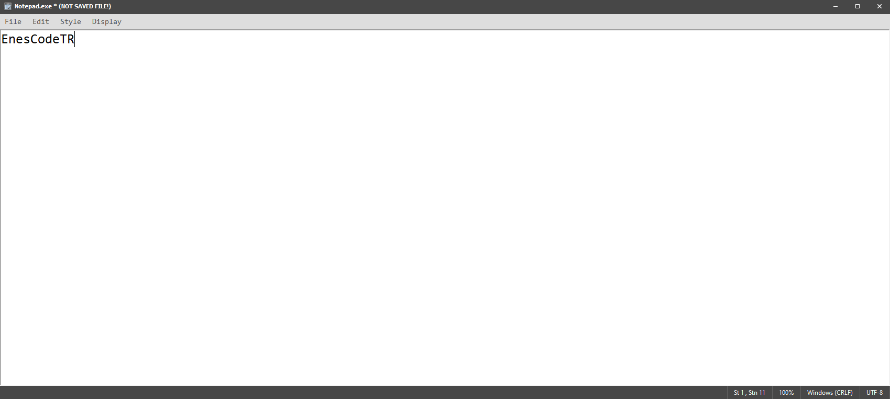
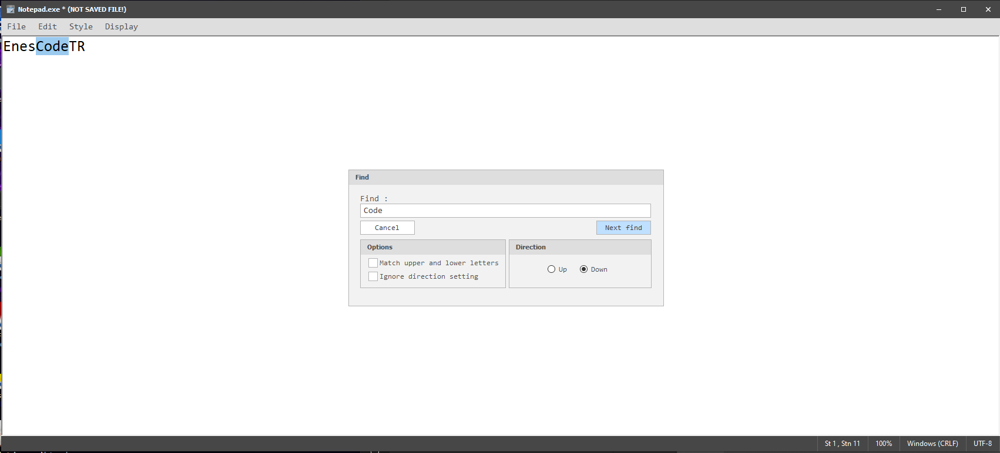

# Windows için Not Defteri Uygulaması.

İndirme Bağlantısı : [Link](https://drive.google.com/file/d/19xz4V5cZLAH5X_1mLLTVrNZ8jSHvW-AV/view)  

Bu program, Windows işletim sisteminde yer alan Not Defteri (Notepad) uygulamasıyla benzer işlevlere sahip olacak şekilde tasarlanmıştır.

Temel metin düzenleme işlemlerini gerçekleştirebilir; kullanıcıların metin yazmasına, düzenlemesine ve kaydetmesine olanak tanır.

Kısacası, Microsoft'un Notepad uygulamasında bulunan özellikleri sunarak sade, anlaşılır ve işlevsel bir kullanıcı deneyimi sağlamayı amaçlar.

## Görsel 1

## Görsel 2

